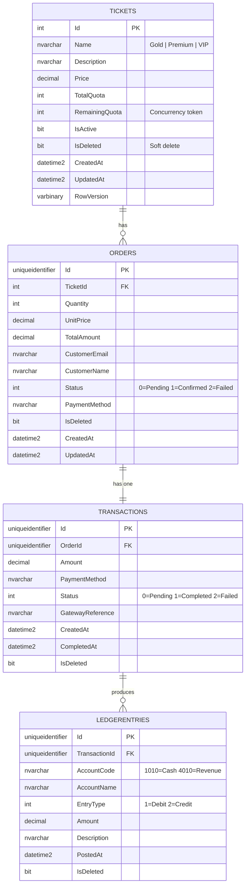

# ETicketLedger

A full-stack **E-Ticketing & Payment Simulation Platform** with a Double-Entry Ledger engine, built with ASP.NET Core 8, React 18 (TypeScript), SQL Server, and Docker.


---

## Quick Start - 5 Minutes ⚡

> **Prerequisites:** Docker Desktop installed and running. That's it.

```bash
# 1. Clone
git clone https://github.com/padmarajan26/ETicketLedger.git
cd ETicketLedger

# 2. Run everything
docker compose up --build
```

| Service     | URL                           |
|-------------|-------------------------------|
| Frontend    | http://localhost:3000         |
| API         | http://localhost:5000         |
| Swagger UI  | http://localhost:5000/swagger |

First run takes ~3–5 minutes (SQL Server image download + NuGet restore + npm install).
The API waits for SQL Server to be healthy before starting - no manual steps needed.

```bash
# Stop
docker compose down

# Stop + wipe database (fresh start)
docker compose down -v
```

---

## ERD Diagram



**Constraints enforced at DB level:**
- All FKs use `ON DELETE RESTRICT` - no orphaned records
- `Tickets.Name` has a unique index
- `Transactions.OrderId` has a unique index (one transaction per order)
- `RemainingQuota` is registered as an EF Core concurrency token

---

## Logic Flow - How the Ledger Stays Accurate

### Normal CreditCard Flow

```
POST /api/orders/checkout
        │
        ▼
┌─────────────────────────────┐
│ 1. Validate request         │  FluentValidation (quota, email, method)
│    Check RemainingQuota > 0 │
└────────────┬────────────────┘
             │
             ▼
┌─────────────────────────────┐
│ 2. Create Order (Pending)   │  All writes in a single SaveChangesAsync()
│    Decrement RemainingQuota │  ← Concurrency token checked here
│    Create Transaction       │
└────────────┬────────────────┘
             │  DbUpdateConcurrencyException?
             │  → HTTP 409, quota NOT decremented
             ▼
┌─────────────────────────────┐
│ 3. CreditCardHandler        │  Instant simulated approval
│    → IsImmediate = true     │
└────────────┬────────────────┘
             ▼
┌─────────────────────────────┐
│ 4. Post Double-Entry Ledger │
│    DEBIT  1010  Cash        │  Amount must equal Credit - throws if not
│    CREDIT 4010  Revenue     │
└─────────────────────────────┘
```

### QR Flow (8-second Background Confirmation)

```
POST /api/orders/checkout (paymentMethod = "QR")
        │
        ▼
  Same steps 1–2 above
        │
        ▼
┌─────────────────────────────┐
│ 3. QRHandler                │
│    → IsImmediate = false    │  Transaction stays Pending
│    → Enqueue TransactionId  │  Into IQRConfirmationQueue (ConcurrentQueue)
└────────────┬────────────────┘
             │  Returns HTTP 201 immediately (Status = "Pending")
             │
             ▼  (background, off the request thread)
┌─────────────────────────────┐
│ QRConfirmationWorker        │  IHostedService polling every 500ms
│   Task.Delay(8 seconds)     │
│   Load Transaction + Order  │
│   Status → Completed        │
│   Post Double-Entry Ledger  │
└─────────────────────────────┘
             │
             ▼
  GET /api/orders/transactions/{id}  ← Frontend polls until Completed
```

### How the Ledger Stays Accurate if the API Crashes Mid-Transaction

This is the critical question. Here is exactly how each scenario is handled:

| Crash point | What happens | Ledger state |
|---|---|---|
| Before `SaveChangesAsync()` | Order never created, quota never decremented | ✅ Clean - nothing written |
| After `SaveChangesAsync()`, before ledger post | Order = Confirmed, Transaction = Completed, **no ledger entries** | ⚠️ Gap - detected by `GET /api/ledger/balance` returning `IsBalanced: false` |
| Inside `PostDoubleEntryAsync()`, after Debit but before Credit | Impossible - both entries are added to the EF change tracker and saved in **one `SaveChangesAsync()` call** | ✅ Atomic - both written or neither |
| QR worker crashes before confirming | Transaction stays `Pending`, no ledger entries | ✅ Clean - order is Pending, quota already decremented, can be reconciled |

**The key protection** is that the two ledger entries (Debit + Credit) are **never saved separately** - they are added to the DbContext together and committed in a single database round-trip. SQL Server either writes both or neither.

The one gap (crash between transaction complete and ledger post) is detectable via `GET /api/ledger/balance` - `IsBalanced: false` signals that a reconciliation job is needed. In a production system this would trigger an alert and an automated reconciliation sweep.

---

## Architecture

```
ETicketLedger/
├── backend/
│   ├── ETicketLedger.API/
│   │   ├── Controllers/          # Tickets, Orders, Ledger
│   │   ├── Models/               # Ticket, Order, Transaction, LedgerEntry, PaymentRequest, PaymentResult
│   │   ├── DTOs/                 # Request / Response shapes
│   │   ├── Enums/                # Enumerators
│   │   ├── Interfaces/           # Interface for all service, backgroundservice and payment handlers
│   │   ├── Services/             # TicketService, OrderService, LedgerService
│   │   ├── Handlers/             # IPaymentHandler, CreditCardHandler, QRHandler
│   │   ├── Validators/           # FluentValidation rules
│   │   ├── BackgroundServices/   # QRConfirmationWorker
│   │   ├── Data/                 # AppDbContext
│   │   ├── Migrations/           # EF migrations
│   │   └── Program.cs            # DI wiring, middleware, Swagger
│   ├── ETicketLedger.Tests/      # xUnit + Moq + FluentAssertions   
│   └── Dockerfile                # Multi-stage: build+test → runtime
├── frontend/
│   ├── src/
│   │   ├── components/           # TicketCard, CheckoutModal, SuccessScreen
│   │   ├── services/api.ts       # Typed Axios client
│   │   ├── styles/               # One CSS file per component
│   │   └── types/index.ts        # Shared TypeScript interfaces
│   ├── nginx.conf                # SPA routing + /api proxy
│   └── Dockerfile                # Node build → nginx serve
├── docker-compose.yml
└── .github/workflows/ci.yml
```

---

## Tech Stack

| Layer      | Technology                                      |
|------------|-------------------------------------------------|
| Backend    | ASP.NET Core 8, EF Core 8, SQL Server 2022      |
| Frontend   | React 18, TypeScript, Vite, Axios               |
| Patterns   | Strategy (payments), Repository (services), DI  |
| Validation | FluentValidation                                |
| Testing    | xUnit, Moq, FluentAssertions, EF InMemory       |
| DevOps     | Docker, Docker Compose, GitHub Actions          |

---

## Key Design Decisions

### 1. Double-Entry Ledger
Every confirmed payment creates exactly **two** `LedgerEntry` rows in one DB transaction:
- **Debit `1010`** - Cash / Payment Gateway (money received)
- **Credit `4010`** - Ticket Sales Revenue (revenue recognised)

`GET /api/ledger/balance` exposes `IsBalanced` - it must always be `true`.

### 2. Concurrency Protection
`Ticket.RemainingQuota` is an EF Core **concurrency token**. If two requests try to decrement the same value simultaneously, one gets a `DbUpdateConcurrencyException` and returns `HTTP 409 Conflict`. The losing request never decrements quota or creates any records.

### 3. Payment Strategy Pattern
```
IPaymentHandler
├── CreditCardHandler  → instant, IsImmediate = true
└── QRHandler          → pending, IsImmediate = false → background queue
```
Adding a new payment method means adding one class and registering it in DI. Zero changes to `OrderService` or controllers.

### 4. Soft Deletes
All tables have `IsDeleted` + `UpdatedAt`. EF global query filters exclude soft-deleted rows transparently. No data is ever hard-deleted - full audit trail is always preserved.

---

## API Endpoints

| Method | Route                               | Description                       |
|--------|-------------------------------------|-----------------------------------|
| GET    | /api/tickets                        | List tickets + remaining quota    |
| GET    | /api/tickets/{id}                   | Single ticket                     |
| POST   | /api/orders/checkout                | Create order + process payment    |
| GET    | /api/orders                         | All orders                        |
| GET    | /api/orders/{id}                    | Single order                      |
| GET    | /api/orders/transactions/{id}       | Poll transaction status (QR)      |
| GET    | /api/ledger/entries                 | All ledger postings               |
| GET    | /api/ledger/balance                 | Debit/Credit totals + IsBalanced  |
| GET    | /health                             | Health check                      |

Full interactive docs: `http://localhost:5000/swagger`

---

## Running Tests

```bash
cd backend
dotnet test --verbosity normal
```

| Test | What it verifies |
|---|---|
| `PostDoubleEntry_Creates_Exactly_Two_Entries` | Always 2 rows per transaction |
| `PostDoubleEntry_Debit_Equals_Credit` | Ledger balance invariant |
| `PostDoubleEntry_Uses_Correct_AccountCodes` | 1010 debit, 4010 credit |
| `GetBalance_ReturnsBalanced_After_Single/MultipleTransactions` | Balance across N transactions |
| `PostDoubleEntry_Throws_WhenAmountIsZero` | Guard against invalid amounts |
| `PostDoubleEntry_Stamps_CorrectTransactionId` | FK integrity on entries |
| `CheckoutValidator_*` | FluentValidation rules (6 cases) |

---

## CI/CD

GitHub Actions runs on every push to `main` or `develop`:

1. `dotnet restore` → `dotnet build` → `dotnet test` (with coverage)
2. `npm ci` → `npm run build` (TypeScript typecheck + Vite build)
3. `docker compose config` - validates compose file syntax

Test results are uploaded as artifacts on every run.
